# User Service Workflows

This document describes the implemented workflows in `fintech-user-service`.

The diagrams reflect the current codebase:

- Customer APIs read the current user from `X-Auth-User-Id`.
- Internal customer creation is exposed as `POST /internal/users`.
- Events are written to `outbox_events`; a Kafka outbox publisher is not implemented yet.
- Profile completion is calculated from `fullName`, `phoneNumber`, and `dateOfBirth`.

## Component Overview

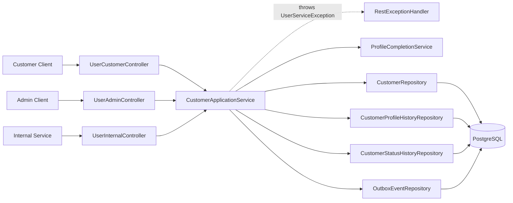

## Customer Creation Workflow

Implemented endpoint:

```text
POST /internal/users
```

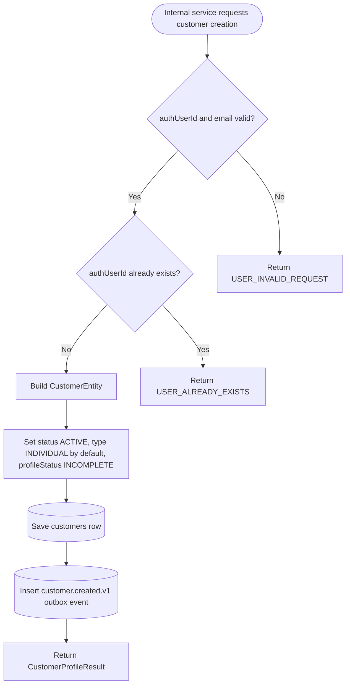

## Customer Creation Sequence

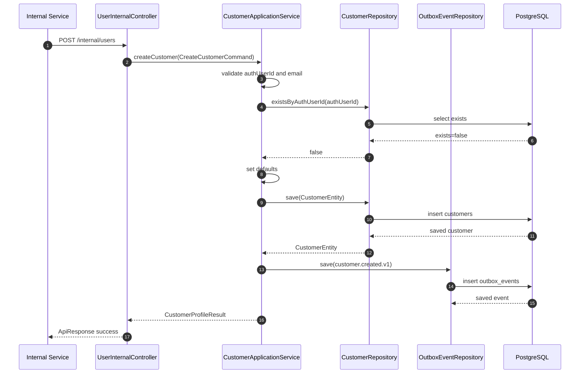

## Get My Profile Workflow

Implemented endpoint:

```text
GET /users/me
```

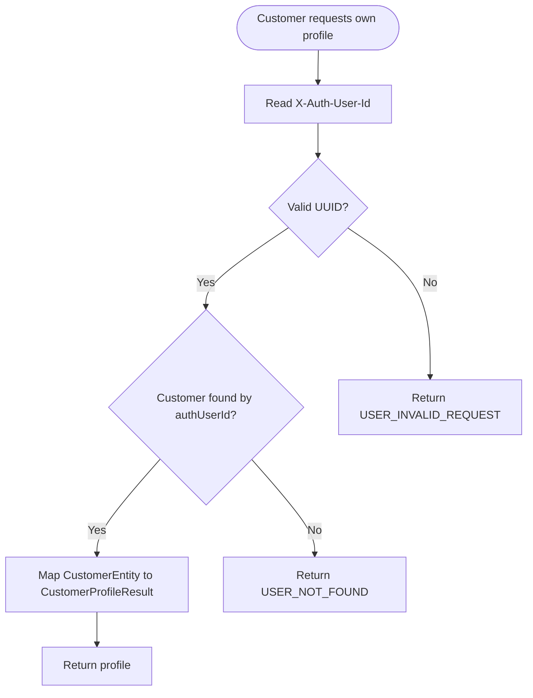

## Get My Profile Sequence

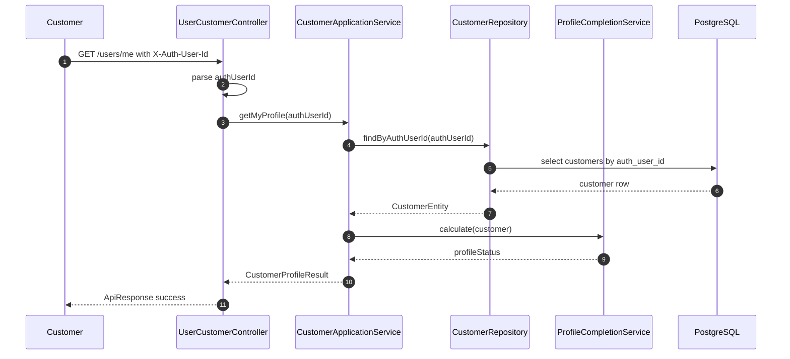

## Update My Profile Workflow

Implemented endpoint:

```text
PUT /users/me
```

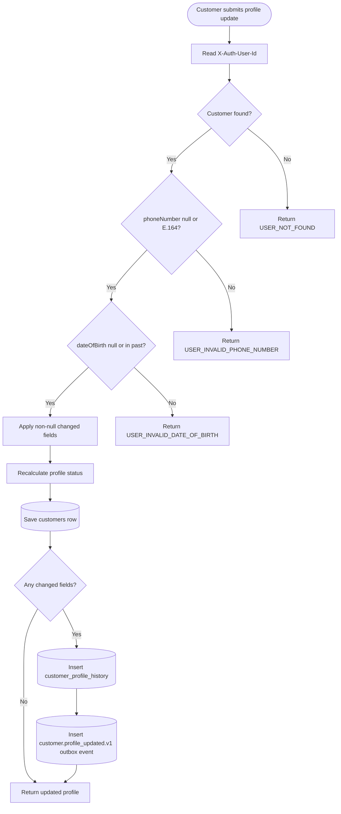

## Update My Profile Sequence

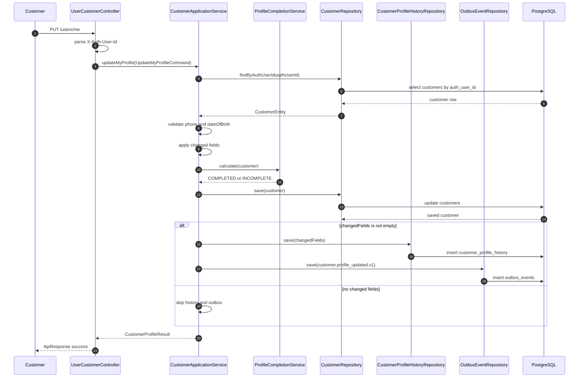

## Profile Completion Workflow

Implemented endpoint:

```text
GET /users/me/profile-status
```

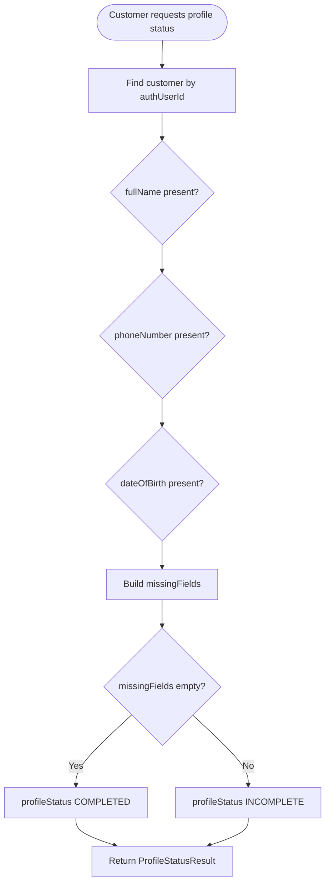

## Admin List And Detail Workflow

Implemented endpoints:

```text
GET /admin/users
GET /admin/users/{customerId}
```

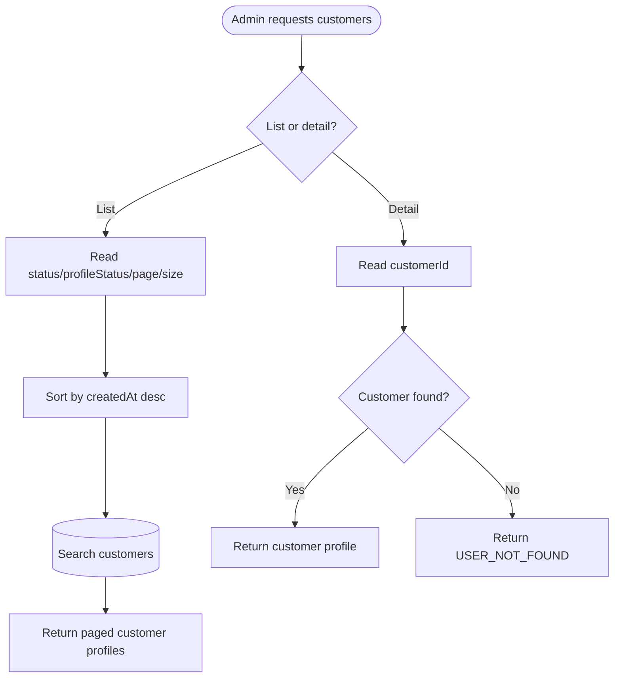

## Admin Status Change Workflow

Implemented endpoints:

```text
POST /admin/users/{customerId}/suspend
POST /admin/users/{customerId}/reactivate
POST /admin/users/{customerId}/close
```

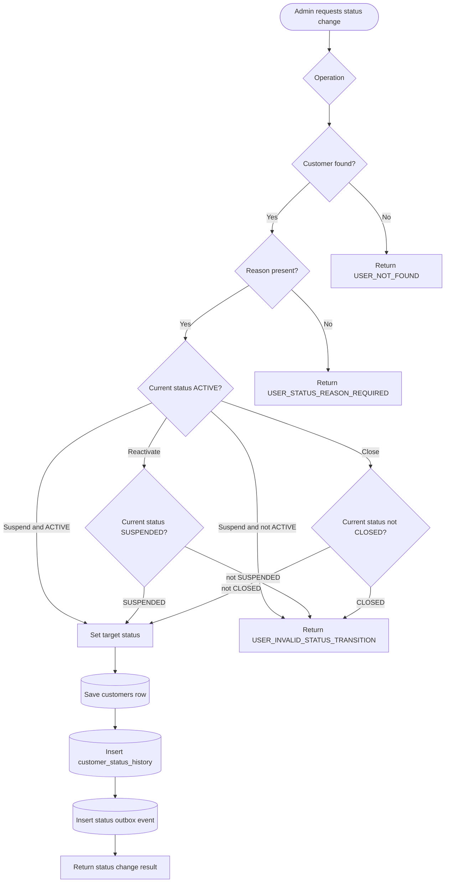

## Suspend Customer Sequence

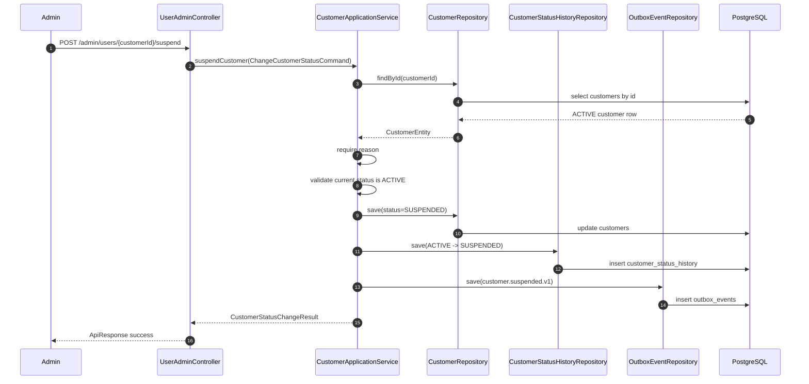

## Reactivate Customer Sequence

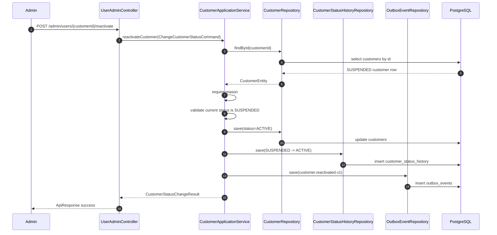

## Close Customer Sequence

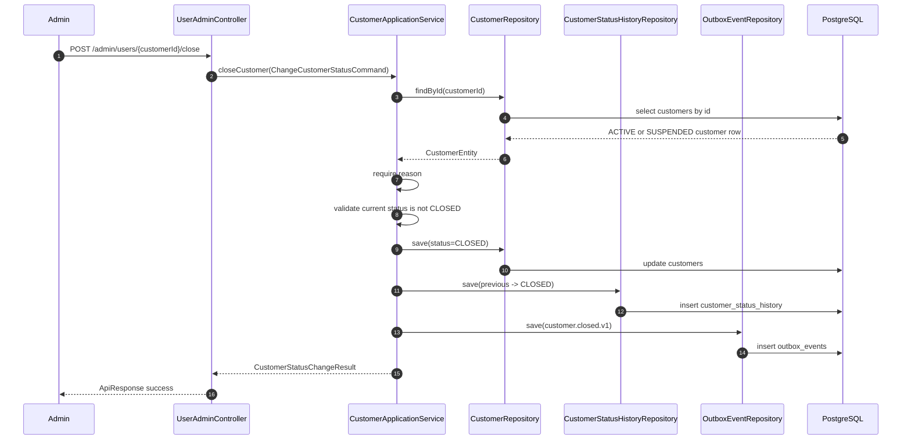

## Internal Customer Lookup Workflow

Implemented endpoint:

```text
GET /internal/users/{customerId}
```

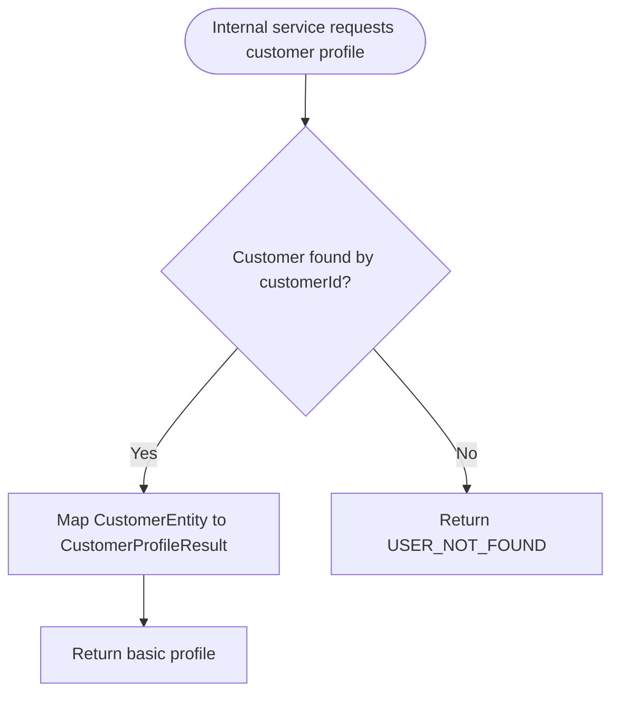

## Eligibility Workflow

Implemented endpoint:

```text
GET /internal/users/{customerId}/eligibility
```

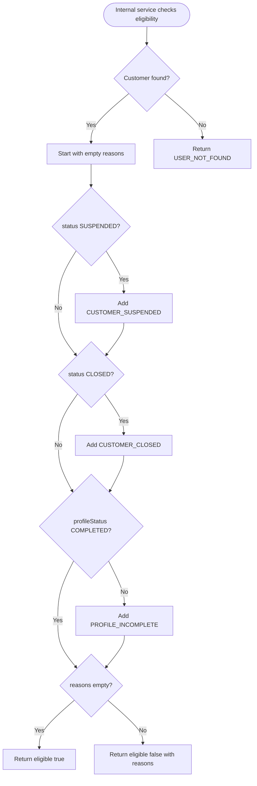

## Eligibility Sequence

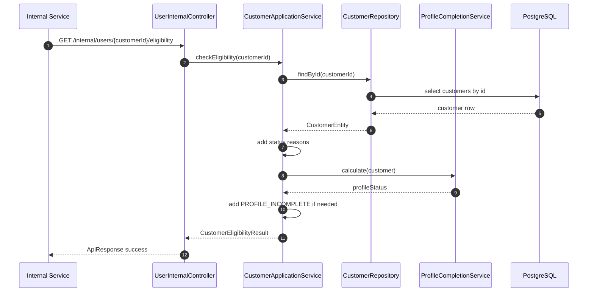

## Error Handling Workflow

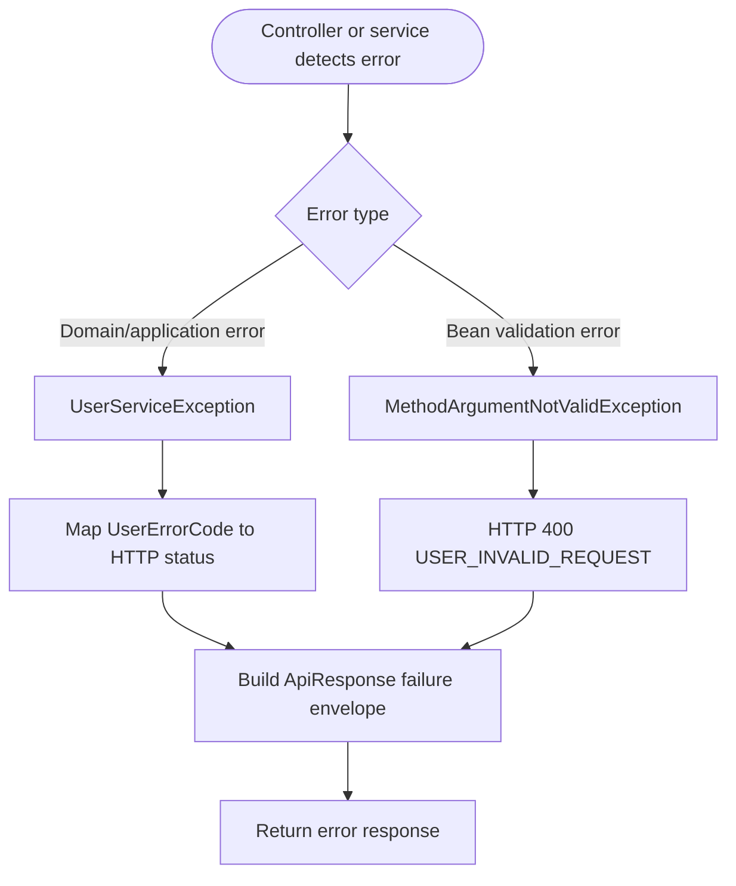

## Outbox Event Workflow

The current service writes outbox records inside the same transaction as customer changes.

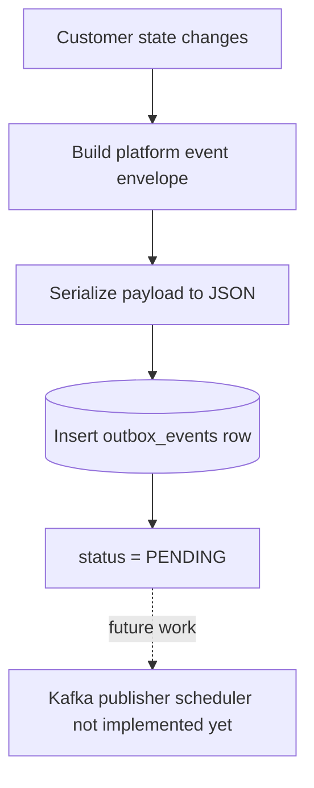

Current outbox event types:

```text
customer.created.v1
customer.profile_updated.v1
customer.suspended.v1
customer.reactivated.v1
customer.closed.v1
```

